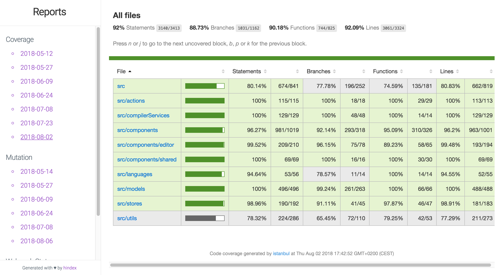

# hindex 🗂
[](https://travis-ci.org/ollelauribostrom/hindex) [](https://coveralls.io/github/ollelauribostrom/hindex?branch=master) [](https://snyk.io/test/github/ollelauribostrom/hindex?targetFile=package.json) [](https://badge.fury.io/js/%40ollelauribostrom%2Fhindex)

Wrap your reports in an index.html file with a single command using **hindex**. Subfolders containing different reports (with an index.html file) can quickly be linked together. Have a look at [an example](https://github.com/ollelauribostrom/hindex#example) of how **hindex** was used to wrap and present reports during a Google Summer of Code project at Mozilla.

Installation
-------
`yarn add hindex` _or_   
`yarn global add hindex` _or_   
`npm install hindex` _or_   
`npm install hindex -g`  

Configuration
-------------
Before you can use **hindex**, you need to create a configuration file called `hindex.config.json`. The following options are available.

| Option            | Description                                           | Type     | Default            |
| ------------------|-------------------------------------------------------| ---------|--------------------|
| baseDir           | The folder containing the subfolders you want to wrap | String   | `process.cwd()   ` |
| exclude           | Array of subfolder you want to exclude when wrapping  | Array    | `['.git']        ` |
| categories        | Array of categories to create                         | Array    | `[]              ` |
| title             | The title used in the generated index.html            | String   | `'hindex'        ` |
| categoryPrefix    | Category name prefix to remove                        | String   | `''              ` |
| categoryPostfix   | Category name postfix to remove                       | String   | `''              ` |
| hideCategoryNames | Remove category names in the generated index.html     | Boolean  | `false           ` |

#### Example `hindex.config.json`
```json
{
  "baseDir": "./reports",
  "exclude": ["some-folder", ".git"],
  "categories": ["coverage"],
  "title": "Coverage reports",
  "categoryPostfix": "-",
  "hideCategoryNames": true
}
```

Usage
-----
> NOTE: Make sure you have created a configuration file called `hindex.config.json`.

### From the command line
A global installation of **hindex** can be used directly from the command line.
```sh
# Generate index.html wrapper
hindex

# Specify a custom path to your hindex config
hindex -c=./config/hindex.config.json
hindex --config=./config/hindex.config.json

# Run in debug mode
hindex -d
hindex --debug

# Print version
hindex -v
hindex --version
```

### From your package.json
A local installation of **hindex** can be used from your project's `package.json`.
```json
"scripts": {
  "hindex": "hindex"
},
```
```sh
yarn hindex
```

### From your code
It's also possible to import **hindex** in your code. The hindex function takes an optional object with the properties described in the [Configuration section](https://github.com/ollelauribostrom/hindex#configuration)
```js
import hindex from '@ollelauribostrom/hindex';

const config = {
  baseDir: '/reports'
  title: 'Reports',
  categories: ['coverage', 'webpack']
};

const result = hindex(config);
// result.dir => reports
// result.index => file:///some/path/reports/index.html
```

Example
-------
This package was originally created to quickly be able to wrap and present different reports that where generated during my [Google Summer of Code project at Mozilla](https://summerofcode.withgoogle.com/projects/#6051875044982784).

#### Report folder structure
```sh
├── .git
├── coverage-2018-05-12
    ├── index.html
├── mutation-2018-05-14
    ├── index.html
├── webpack-stats-2018-05-31
    ├── index.html
├── hindex.config.json
├── package.json
```

#### Setup
package.json
```json
"scripts": {
  "hindex": "hindex"
},
...
```
hindex.config.json
```json
{
  "exclude": [".git"],
  "categories": ["coverage", "mutation", "webpack-stats"],
  "title": "Reports"
}
```

#### Wrapping
Each time a new report folder was added, a new wrapping index.html could quickly be generated.
```
yarn hindex
```

#### Result
[Live example](https://ollelauribostrom.github.io/gsoc/)



Running your own local development copy
---------------------------------------
```sh
# Install dependencies
yarn

# Create a symbolic link
yarn link

# Start babel in watch mode
yarn start

# Run your development copy
hindex
```

Running the tests
-----------------
`yarn test`    
`yarn coverage`    
`yarn lint` 

Contributing
------------
All contributions are very much welcome. Please get familiar with the [contributing guide](https://github.com/ollelauribostrom/hindex/blob/master/.github/CONTRIBUTING.md).

Support
-------
Please [open an issue](https://github.com/ollelauribostrom/hindex/issues/new) for support.

License
-------
MIT
